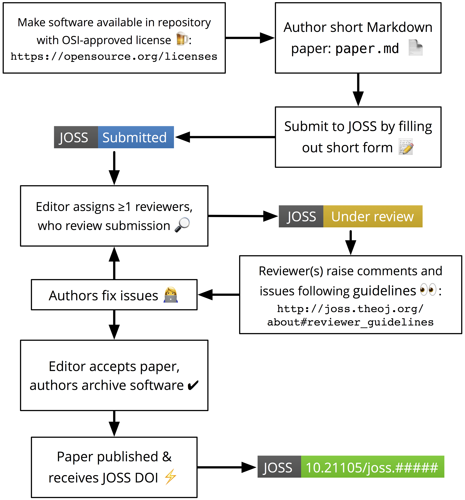

Editorial Guide
===============

The Journal of Open Source Software (JOSS) conducts all peer review and editorial processes in the open, on the GitHub issue tracker.

JOSS editors manage the review workflow with the help of our bot, `@whedon`. The bot is summoned with commands typed directly on the GitHub review issues. For a list of commands, type: `@whedon commands`.

```eval_rst
.. note:: To learn more about ``@whedon``'s functionalities, take a look at our `dedicated guide <whedon.html>`_.
```

## Pre-review

Once a submission comes in, it will be in the queue for a quick check by the Editor-in-chief (EiC). From there, it moves to a `PRE-REVIEW` issue, where the EiC will assign a handling editor, and the author can suggest reviewers. Initial direction to the authors for improving the paper can already happen here, especially if the paper lacks some requested sections.

```eval_rst
.. important:: If the paper is out-of-scope for JOSS, editors assess this and notify the author in the ``PRE-REVIEW`` issue.
```

The EiC assigns an editor (or a volunteering editor self-assigns) with the command `@whedon assign @username as editor` in a comment.

```eval_rst
.. note:: If a paper is submitted without a recommended editor, it will show up in the weekly digest email under the category ‘Papers currently without an editor.’ Please review this weekly email and volunteer to edit papers that look to be in your domain. If you choose to be an editor in the issue thread type the command ``@whedon assign @yourhandle as editor``
```

### How papers are assigned to editors

By default, unless an editor volunteers, the Associated Editor-in-chief (AEiC) on duty will attempt to assign an incoming paper to the most suitable handling editor. While AEiCs will make every effort to match a submission with the most appropriate editor, there are a number of situations where an AEiC may assign a paper to an editor that doesn't fit entirely within the editor's research domains:

- If there's no obvious fit to _any_ of the JOSS editors
- If the most suitable editor is already handling a large number of papers
- If the chosen editor has a lighter editorial load than other editors

In most cases, an AEiC will ask one or more editors to edit a submission (e.g. `@editor1, @editor 2 - would one of you be willing to edit this submission for JOSS`). If the editor doesn't respond within ~3 working days, the AEiC may assign the paper to the editor regardless.

### Finding reviewers

At this point, the handling editor's job is to identify reviewers who have sufficient expertise in the field of software and in the field of the submission. JOSS papers have to have a minimum of two reviewers per submission, except for papers that have previously been peer-reviewed via rOpenSci. In some cases, the editor also might want to formally add themself as one of the reviewers. If the editor feels particularly unsure of the submission, a third (or fourth) reviewer can be recruited.

To recruit reviewers, the handling editor can mention them in the `PRE-REVIEW` issue with their GitHub handle, ping them on Twitter, or email them. After expressing initial interest, candidate reviewers may need a longer explanation via email. See sample reviewer invitation email, below.

Once a reviewer accepts, the handling editor runs the command `@whedon assign @username as reviewer` in the `PRE-REVIEW` issue. Add more reviewers with the command `@whedon add @username as reviewer`.

```eval_rst
.. note:: The ``assign`` command clobbers all reviewer assignments. If you want to add an additional reviewer use the ``add`` command.
```

### Starting the review

Next, run the command `@whedon start review`. If you haven't assigned an editor and reviewer, this command will fail and `@whedon` will tell you this. This will open the `REVIEW` issue, with prepared review checklists for each reviewer, and instructions. The editor should close the `PRE-REVIEW` issue, at this point, and move the conversation to the separate `REVIEW` issue.

## Review

The `REVIEW` issue contains some instructions, and reviewer checklists. The reviewer(s) should check off items of the checklist one-by-one, until done. In the meantime, reviewers can engage the authors freely in a conversation aimed at improving the paper.

If a reviewer recants their commitment or is unresponsive, editors can remove them with the command `@whedon remove @username as reviewer`. You can also add new reviewers in the `REVIEW` issue, but in this case, you need to manually add a review checklist for them by editing the issue body.

Comments in the `REVIEW` issue should be kept brief, as much as possible, with more lengthy suggestions or requests posted as separate issues, directly in the submission repository. A link-back to those issues in the `REVIEW` is helpful.

When the reviewers are satisfied with the improvements, we ask that they confirm their recommendation to accept the submission.

## After acceptance

When a submission is accepted, we ask that the authors create an archive (on [Zenodo](https://zenodo.org/), [fig**share**](https://figshare.com/), or other) and post the archive DOI in the `REVIEW` issue. The editor should add the `accepted` label on the issue, run the command` @whedon set <archive doi> as archive`, and ping the EiC for final processing.

Steps:
- Get a new proof with the `@whedon generate pdf` command.
- Download the proof, check all references have DOIs, follow the links and check the references.
  - Whedon can help check references with the command `@whedon check references`
- Give the paper a proof-read and ask authors to fix typos.
- Ask the author to make a Zenodo archive, and report the DOI in the review thread.
- Check the Zenodo deposit has the correct metadata (title and author list), and request the author edit it if it doesn’t match the paper.
- Run `@whedon set <doi> as archive`.
- Run `@whedon set <v1.x.x> as version` if the version was updated.
- Ping the `@openjournals/joss-eics` team on the review thread letting them know the paper is ready to be accepted.

At that point, the EiC/AEiC will take over to publish the paper.

It’s also a good idea to ask the authors to check the proof. We’ve had a few papers request a post-publication change of author list, for example—this requires a manual download/compile/deposit cycle and should be a rare event.

## Processing of rOpenSci-reviewed and accepted submissions

If a paper has already been reviewed and accepted by rOpenSci, the streamlined JOSS review process is:

- Assign yourself as editor and reviewer
- Add a comment in the pre-review issue pointing to the rOpenSci review
- Start the review issue
- Add a comment in the review issue pointing to the rOpenSci review
- Compile the paper and check it looks ok
- Tick off all the review checkboxes
- Go to to the source code repo and grab the Zenodo DOI
- Accept the paper

## Sample letter to invite reviewers

```
Dear Dr. Jekyll,

I found you following links from the page of The Super Project and/or on Twitter. This
message is to ask if you can help us out with a submission to JOSS (The Journal of Open
Source Software), where I’m an editor.

JOSS publishes articles about open source research software. The submission I'd like you
to review is titled: "great software name here"

and the submission repository is at: https://github.com/< … >

JOSS is a free, open-source, community driven and developer-friendly online journal
(no publisher is seeking to raise revenue from the volunteer labor of researchers!).

The review process at JOSS is unique: it is open and author-reviewer-editor conversations
are encouraged.

JOSS reviews involve downloading and installing the software, and inspecting the repository
and submitted paper for key elements. See https://joss.readthedocs.io/en/latest/review_criteria.html

Editors and reviewers post comments on the Review issue, and authors respond to the comments
and improve their submission until acceptance (or withdrawal, if they feel unable to
satisfy the review).

Would you be able to review this submission for JOSS? If not, can you recommend
someone from your team to help out?

Kind regards,

JOSS Editor.
```

## Overview of editorial process

**Step 1: An author submits a paper.**

The author can choose to select an preferred editor based on the information available in our biographies. This can be changed later.

**Step 2: If you are selected as an editor you get @-mentioned in the pre-review issue.**

This doesn’t mean that you’re the editor, just that you’ve been suggested by the author.

**Step 3: Once you are the editor, find the link to the code repository in the `pre-review` issue**

**Step 4: The editor looks at the software submitted and checks to see if:**

- There’s a general description of the software
- The software is within scope as research software
- It has an OSI-approved license

**Step 5: The editor responds to the author saying that things look in line (or not) and will search for reviewer**

**Step 6: The editor finds >= 2 reviewers**

- Use the list of reviewers: type the command `@whedon list reviewers` or look at list of reviewers in a Google [spreadsheet](https://docs.google.com/spreadsheets/d/1PAPRJ63yq9aPC1COLjaQp8mHmEq3rZUzwUYxTulyu78/edit?usp=sharing)
- If people are in the review list, the editor can @-mention them on the issue to see if they will review: e.g. `@person1 @person2 can you review this submission for JOSS?`
- Or solicit reviewers outside the list. Send an email to people describing what JOSS is and asking if they would be interested in reviewing.

**Step 7: Editor tells Whedon to assign the reviewer to the paper**

- Use `@whedon assign @reviewer as reviewer`
- To add a second reviewer use `@whedon add @reviwer2 as reviewer`

```eval_rst
.. note:: The ``assign`` command clobbers all reviewer assignments. If you want to add an additional reviewer use the ``add`` command.
```

**Step 8: Create the actual review issue**

- Use `@whedon start review`
- An issue is created with the review checklist, one per reviewer, e.g. https://github.com/openjournals/joss-reviews/issues/717

**Step 9: Close the pre-review issue**

**Step 10: The actual JOSS review**

- The reviewer reviews the paper and has a conversation with the author. The editor lurks on this conversation and comes in if needed for questions (or CoC issues).
- The reviewer potentially asks for changes and the author makes changes. Everyone agrees it’s ready.

**Step 11: The editor pings the EiC team to get the paper published**

- To get the paper published, ping the `@openjournals/joss-eics` team on the review thread letting them know the paper is ready to be accepted.

**Step 12: Celebrate publication! Tweet! Thank reviewers! Say thank you on issue.**

## Visualization of editorial flow



## Expectations on JOSS editors

### Responding to editorial assignments

As documented above, usually, papers will be assigned to you by one of the AEiCs. We ask that editors do their best to respond in a timely fashion (~ 3 working days) to invites to edit a new submission.

### Continued attention to assigned submissions

As an editor, part of your role is to ensure that submissions you're responsible for are progressing smoothly through the editorial process. This means that once or twice per week we ask that you check your GitHub notifications and/or your editorial dashboard (e.g. `http://joss.theoj.org/dashboard/youreditorname`) for updates to the papers you are handling.

**If reviews go stale**

Sometimes reviews go quiet, either because a reviewer has failed to complete their review or an author has been slow to respond to a reviewer's feedback. **As the editor, we need you to prompt the author/or reviewer(s) to revisit the submission if there has been no response within 7-10 days unless there's a clear statement in the review thread that says an action is coming at a slightly later time, perhaps because a reviewer committed to a review by a certain date, or an author is making changes and says they will be done by a certain date.**

[Whedon has functionality](https://joss.readthedocs.io/en/latest/whedon.html#reminding-reviewers-and-authors) to remind an author or review to return to a review at a certain point in the future. For example:

```
@whedon remind @reviewer in five days
```

## Out of office

Sometimes we need time away from our editing duties at JOSS. The [joss-reviews](https://github.com/openjournals/joss-reviews) repository has the [OoO bot](https://github.com/swinton/probot-ooo) installed which means you can mark yourself as out of the office (and unable to respond to reviews) for a period of time e.g.:

Mark yourself as OoO in one of the reviews you're editing in the [joss-reviews](https://github.com/openjournals/joss-reviews) repository like this:

```
/ooo January 18 until February 2
```

Ooo bot will then respond to any mentions in the [joss-reviews](https://github.com/openjournals/joss-reviews) repository to let people know you're away.

**Note, if you're planning on being out of the office for more than two weeks, please let the JOSS editorial team know.**
